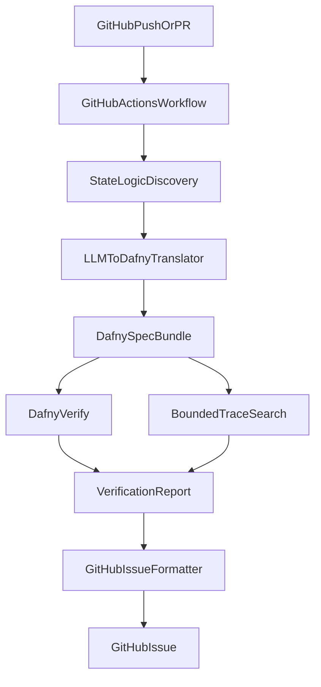

# Phased Plan For Invariant

## Assumptions

- Current repo is only [README.md](README.md), so this plan assumes a greenfield build.
- Initial operating model: single repo, triggered by GitHub Actions on `push` and `pull_request`.
- Initial verification target: LLM-generated Dafny from application state logic, but only for a narrow, explicit state-machine surface first.
- First supported app shape: reducer-style state transitions or a small action/state module, not arbitrary full-app React behavior.

## Why This Shape

The referenced `dafny-replay` workflow shows a practical split:

- Dafny owns `Model`, `Action`, `Inv`, `Apply`, and proof obligations.
- UI/framework code stays outside the proof boundary.
- The reusable proof obligation is small: prove `Inv(Init())` and `Inv(m) => Inv(Normalize(Apply(m, action)))`.

That makes the first milestone much more feasible if we verify one extracted state machine rather than "the whole app".

## Target Architecture

## Phase 1: Narrow End-to-End Vertical Slice

Goal: prove the whole loop works on one tiny state machine.

Build:

- [agent/examples/](agent/examples/) with one intentionally small reducer-style example.
- [agent/prompts/translator.md](agent/prompts/translator.md) for the LLM prompt contract.
- [agent/dafny/](agent/dafny/) containing a minimal reusable Dafny template inspired by the `dafny-replay` split between domain logic and proof obligation.
- [scripts/run-local-verifier.ts](scripts/run-local-verifier.ts) to orchestrate discovery, translation, `dafny verify`, and result capture.
- [.github/workflows/verify-state.yml](.github/workflows/verify-state.yml) to run the same pipeline in CI.

Deliverable:

- A push to the repo runs one workflow that translates a known sample state machine to Dafny and produces either:
  - a passing proof summary, or
  - a failing artifact bundle with generated Dafny and raw verifier output.

Exit criteria:

- The system is deterministic for the sample input.
- Generated artifacts are uploaded from CI for inspection.
- No GitHub issue filing yet.

## Phase 2: Define The Verification Contract

Goal: make the agent reliable by shrinking what it is allowed to translate.

Build:

- [agent/contracts/state-machine-schema.ts](agent/contracts/state-machine-schema.ts) describing the intermediate representation: `State`, `Action`, `Init`, transition function, invariants, and optional normalization rules.
- [agent/discovery/](agent/discovery/) to extract candidate reducer/action code from a small set of supported patterns.
- [agent/invariants/](agent/invariants/) for invariant sources:
  - explicit annotations in code comments or config,
  - repo-local invariant files,
  - LLM-proposed invariants marked as draft until accepted.

Key decision:

- Treat translation as a two-step pipeline:
  1. source code -> typed state-machine IR
  2. IR -> Dafny

This makes failures debuggable and lets us reject unsupported code early instead of generating misleading proofs.

Exit criteria:

- Unsupported state logic fails with a clear explanation.
- Supported logic emits a stable IR and a stable Dafny bundle.

## Phase 3: Counterexample Trace Generation

Goal: produce the concrete sequence of actions that breaks an invariant.

Build:

- [agent/trace/](agent/trace/) for bounded action-sequence search over the extracted IR.
- [agent/trace/trace-to-dafny.ts](agent/trace/trace-to-dafny.ts) to encode candidate traces and failing postconditions.
- [agent/reports/counterexample.ts](agent/reports/counterexample.ts) to turn solver output into a human-readable replay.

Important nuance:

- A proof failure does not automatically equal a product bug; it may be a missing lemma, weak spec, or translation error.
- To satisfy the product promise, pair theorem proving with witness generation:
  - `proof mode`: prove invariants for all transitions.
  - `witness mode`: bounded search for the shortest concrete action trace violating an invariant or postcondition.

Recommended initial implementation:

- Start with bounded search over action sequences of length `1..N` on the IR.
- Use Dafny/solver counterexample extraction only as a debugging aid.
- Report a bug only when the failing trace can be replayed against the generated transition model and, where possible, the source-language implementation.

Exit criteria:

- CI can emit a minimal action trace such as `Init -> AddItem("x") -> RemoveLastItem -> Undo` plus the exact invariant that fails.
- The trace is replayable in a local script.

## Phase 4: GitHub Issue Filing With Mathematical Evidence

Goal: automatically open actionable issues only when confidence is high.

Build:

- [agent/github/issue-template.ts](agent/github/issue-template.ts) for issue title/body generation.
- [agent/github/post-issue.ts](agent/github/post-issue.ts) using `GITHUB_TOKEN` in Actions.
- [agent/reports/proof-summary.ts](agent/reports/proof-summary.ts) to summarize verified obligations, failed obligations, and confidence notes.

Issue format:

- State machine analyzed.
- Invariant or theorem that failed.
- Short proof-oriented explanation in plain English.
- Concrete counterexample trace.
- Serialized before/after states for each step.
- Links to CI artifacts: generated Dafny, raw verifier logs, replay script output.

Guardrails:

- Do not file duplicate issues for the same invariant + normalized trace.
- Mark issues as `needs-human-triage` until source replay confirms the failure.

Exit criteria:

- A failing CI run can open one deduplicated issue with artifact links and a reproducible trace.

## Phase 5: Source-Language Replay And Confidence Scoring

Goal: reduce false positives before the agent starts opening issues routinely.

Build:

- [agent/replay/](agent/replay/) to execute the counterexample against the original reducer/state module.
- [agent/confidence/score.ts](agent/confidence/score.ts) to rank findings based on:
  - successful replay in source code,
  - invariant confidence level,
  - translation coverage,
  - whether unsupported constructs were skipped.

Policy:

- Only auto-file issues when:
  - translation coverage is above a threshold,
  - the trace replays in source,
  - the failure is not explained by an unsupported construct.
- Otherwise, upload artifacts and comment on the PR instead of filing an issue.

Exit criteria:

- The agent distinguishes `proved safe`, `likely real bug`, and `needs review`.

## Phase 6: Real Repository Adoption

Goal: move from toy examples to one real app module.

Build:

- [invariant.config.ts](invariant.config.ts) for repo-local configuration:
  - which files define supported state machines,
  - which invariants to enforce,
  - action-depth bounds,
  - issue filing policy.
- One pilot integration against a real reducer/state module in this repo once such code exists.

Rollout strategy:

- Start with one critical workflow such as checkout state, auth/session state, permissions state, or editor/document state.
- Keep the proof boundary small and explicit.
- Require human review of generated invariants until the invariant library matures.

Exit criteria:

- One production-relevant state machine is continuously checked on each push.

## Phase 7: Hardening And Expansion

Goal: make the agent trustworthy enough for regular use.

Build:

- Caching for Dafny toolchain and generated artifacts in CI.
- Snapshot tests for the IR and generated Dafny.
- Golden counterexample tests using given-when-then function names.
- Metrics for proof pass rate, translation failure rate, false positive rate, and median CI time.
- Optional PR comments summarizing proof coverage deltas.

Future expansion after this:

- Support more than reducer-style patterns.
- Add organization-wide GitHub App mode.
- Learn invariant templates per domain type.
- Move from issue filing only to suggested source patches.

## Recommended Implementation Order

1. Phase 1 to prove the workflow can run at all.
2. Phase 2 to constrain scope before complexity grows.
3. Phase 3 before issue filing, because actionable traces are the product differentiator.
4. Phase 4 once counterexamples are trustworthy.
5. Phase 5 before broad rollout to keep noise acceptable.
6. Phase 6 on a single real module.
7. Phase 7 after the pilot is stable.

## Biggest Risks

- "Translate your app's state logic" is too broad unless we strictly define supported patterns.
- Proof failures can come from weak specs or translation bugs, not just real product bugs.
- Counterexamples from the solver may be hard to interpret unless we normalize them into action traces.
- CI latency will get expensive if translation, proof, and bounded search all run on every push without caching or scoping.

## First Build Slice I Recommend

Implement only this in the first iteration:

- one reducer-style sample,
- one manually supplied invariant,
- one GitHub Actions workflow,
- one generated Dafny bundle,
- one bounded counterexample trace,
- no automatic issue creation until replay validation is in place.
